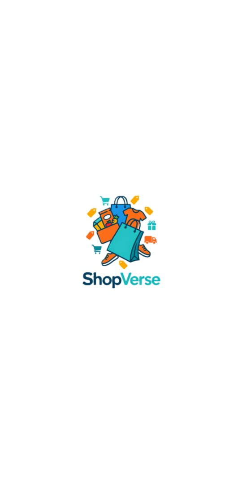
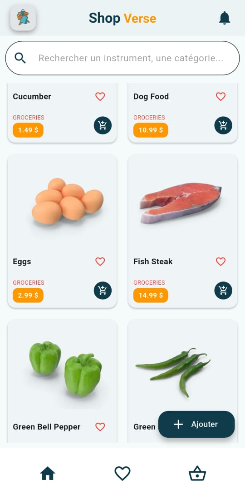
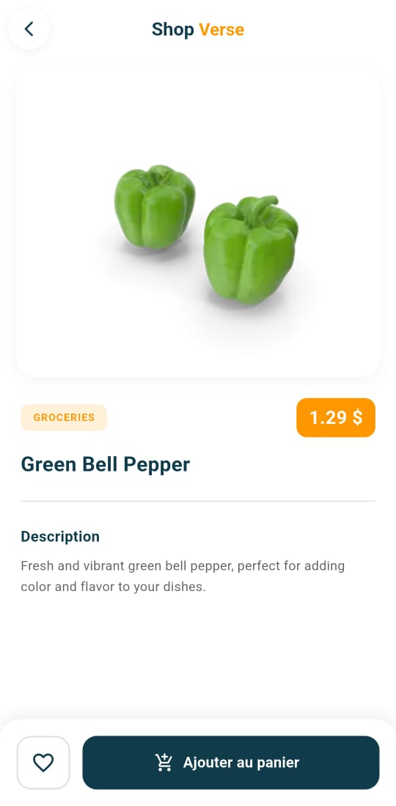
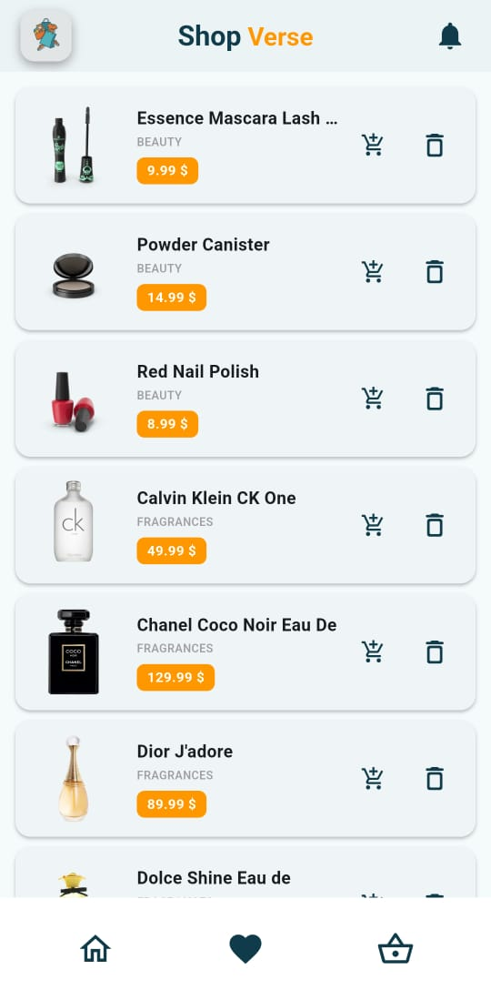
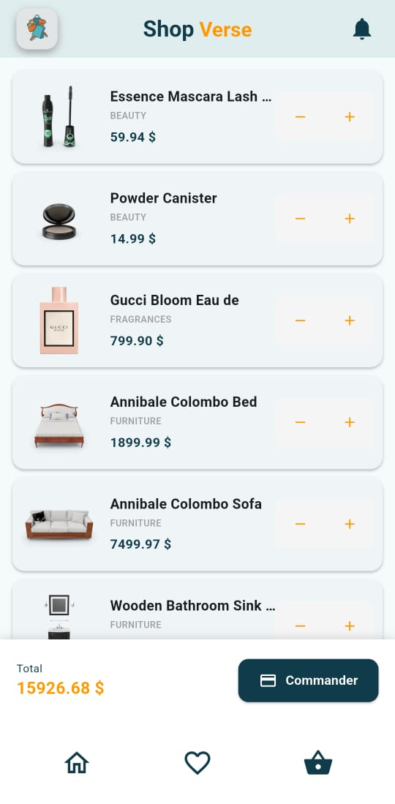

# 🎵 ShopVerse (e_instru) - Flutter E-Commerce UI Template

[](https://flutter.dev)
[](https://dart.dev)
[](https://riverpod.dev)
[](https://pub.dev/packages/sqflite)

**ShopVerse** (nom de code du projet : `e_instru`) est un UI Template mobile moderne, élégant et entièrement réutilisable développé avec **Flutter**. Spécialement conçu pour les applications d'e-commerce (vente d'instruments de musique ou autre catalogue de produits), ce projet propose une architecture propre basée sur le state management **Riverpod** et une persistance locale avec **Sqflite**.

> 💡 **Remarque :** Ce projet est un **UI/Frontend Kit clé en main** que vous pouvez adapter, connecter à votre propre API REST/GraphQL ou réutiliser comme base pour vos futurs projets Flutter.

---

## 📸 Aperçu de l'Application

### Logo & Écran de Démarrage

<p align="center">
  
  <br>
  
</p>

### Parcours Utilisateur & Écrans Principaux

<p align="center">
  
  
  
  
</p>

---

## ✨ Fonctionnalités Principales

- 🔐 **Écrans d'Authentification** : Connexion et inscription modernes avec validation des champs.
- 🛍️ **Catalogue de Produits** : Recherche dynamique, filtrage par catégorie et cartes d'affichage réutilisables.
- 📄 **Fiche Produit Détaillée** : Présentation complète avec carrousel d'images, description, prix et sélection de quantité.
- ❤️ **Gestion des Favoris (SQLite)** : Ajout / retrait de favoris synchronisé localement avec **Sqflite**.
- 🛒 **Panier d'Achat Réactif** : Gestion de la quantité d'articles, calcul du total et persistance SQLite.
- ⚡ **Gestion d'État Moderne (Riverpod)** : State management propre et réactif avec Riverpod 3.
- 🎨 **Design UI/UX Soigné** : Skeleton loaders (shimmer), retours visuels (Snackbars personnalisées) et transitions fluides.

---

## 🛠️ Stack Technique & Bibliothèques

- **Framework** : [Flutter SDK](https://flutter.dev)
- **Gestion d'état** : [Flutter Riverpod](https://pub.dev/packages/flutter_riverpod)
- **Base de données locale** : [Sqflite](https://pub.dev/packages/sqflite) & [Path](https://pub.dev/packages/path)
- **Requêtes HTTP** : [Http](https://pub.dev/packages/http)
- **Personnalisation d'icônes & Splash** : `flutter_launcher_icons` & `flutter_native_splash`

---

## 📁 Structure du Projet

L'architecture du projet respecte la séparation des responsabilités (**Clean Architecture / Feature-oriented**) pour faciliter l'extension et la réutilisation :

```text
lib/
├── models/             # Modèles de données (Instrument, CartItem, etc.)
├── providers/          # Providers Riverpod pour la gestion d'état (Panier, Favoris, Navigation)
├── screens/            # Écrans principaux de l'application
│   ├── auth_screen/    # Connexion & Inscription
│   ├── catalog_screen.dart
│   ├── favorite_screen.dart
│   ├── home_screen.dart
│   ├── panier_screen.dart
│   └── product_detail_screen.dart
├── services/           # Services de données (SQLite, API, etc.)
│   ├── app_database.dart
│   ├── favoris_db_service.dart
│   ├── instrument_service.dart
│   └── panier_db_service.dart
├── widgets/            # Composants UI réutilisables
│   ├── auth_form/
│   ├── catalogue/
│   ├── detail_instru/
│   ├── favoris/
│   └── panier/
└── main.dart           # Point d'entrée de l'application
```

---

## 🚀 Installation & Démarrage

### Prérequis
- [Flutter SDK](https://docs.flutter.dev/get-started/install) (version `3.11.4` ou plus récente)
- Un émulateur Android/iOS ou un appareil physique connecté

### Procédure

1. **Cloner le projet** :
   ```bash
   git clone https://github.com/votre-compte/e_instru.git
   cd e_instru
   ```

2. **Installer les dépendances** :
   ```bash
   flutter pub get
   ```

3. **Lancer l'application** :
   ```bash
   flutter run
   ```

---

## 🤝 Réutilisation & Contribution

Ce projet a été conçu pour servir de **modèle / starter kit**. Sentez-vous libre de :
- Forker ce dépôt.
- Adapter le thème graphique (`lib/widgets/colors.dart`).
- Remplacer les données de test ou les services SQLite (`lib/services/`) par vos propres API endpoints.

---

## 📝 Licence

Ce projet est disponible sous licence **MIT**. Vous pouvez l'utiliser et le modifier librement pour vos projets personnels ou commerciaux.
